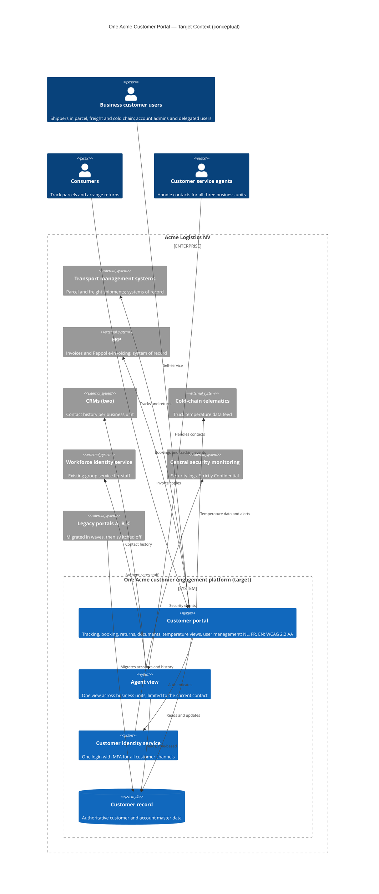

# Architecture Vision: One Acme Customer Portal

## Document Control

| Field | Value |
|-------|-------|
| **Document ID** | ARC-001-ADMP-v1.0 |
| **Document Type** | Architecture Vision — TOGAF ADM Preliminary Phase |
| **Project** | One Acme Customer Portal (Project 001) |
| **Classification** | Confidential |
| **Status** | DRAFT |
| **Version** | 1.0 |
| **Created Date** | 2026-10-08 |
| **Last Modified** | 2026-10-08 |
| **Review Cycle** | Monthly (during active ADM cycle) |
| **Next Review Date** | 2026-11-08 |
| **Owner** | Enterprise Architecture team, for Annelies Claes (COO, Programme Sponsor) |
| **Reviewed By** | [PENDING] |
| **Approved By** | [PENDING] |
| **Distribution** | Architecture Board; programme steering committee; Executive Committee (summary) |

> **Classification note**: This document uses the Acme data classification scheme (Public / Internal / Confidential / Strictly Confidential) [AIP-C1]. It is marked **Confidential** because it contains the investment envelope and the negotiating position on supplier contracts.

### Revision History

| Version | Date | Author | Changes | Approved By | Approval Date |
|---------|------|--------|---------|-------------|---------------|
| 1.0 | 2026-10-08 | ArcKit AI | Initial creation from `/arckit-togaf-adm:adm-preliminary` command | PENDING | PENDING |

---

## 1. Architecture Vision

By the end of 2028, every Acme customer deals with **one Acme**: one brand, one login and one customer record, whether they send a consumer parcel, book a pallet of freight or move temperature-controlled pharma goods [ACP-C1] [PM-C1]. Customers serve themselves first. They track shipments, book, return goods, and get invoices, proof of delivery and temperature certificates themselves, in Dutch, French or English, on any device and to WCAG 2.2 AA. They contact Acme only when they need a person. When they do, an agent sees the relevant shipment, account and documents in one view, limited to what that contact needs.

This replaces a landscape built by acquisition. Three business units each run their own customer portal, user store and integrations. 1,800 business customers juggle several accounts, and agents switch between three portals and two CRMs [ACP-C2] [SI-C1]. In the target architecture, customer engagement is a **group capability on a shared platform**, bought rather than built wherever the capability is not differentiating [AIP-C2]. One identity service protects every account with MFA, and one authoritative customer record makes data subject rights answerable within the legal deadline. Business-unit specifics (EDI order upload for freight, audit-proof temperature evidence for cold chain, returns for parcel) are features of the shared platform, not separate systems.

The vision is measured by outcomes, not by go-lives:

- **Run cost**: at least 35% lower portal run cost [PM-C3]
- **Contact centre**: 40% fewer "where is my shipment?" calls, and faster, first-time-right handling [PM-C4]
- **Compliance**: data subject requests answered on time and MFA for every user [PM-C5]
- **Continuity**: no loss of the features that business and pharma customers rely on

All of this is delivered without disrupting peak season. It follows the Acme architecture principles (ARC-000-PRIN-v1.0), in particular One Acme Customer Experience (1), Reuse, Then Buy, Then Build (2), Digital Self-Service by Default (3), Unified Identity and Access (9) and Single Source of Truth (14).

## 2. Scope

**Engagement scope: Business Unit (customer engagement domain).** This ADM cycle covers the customer engagement domain across all three Acme business units: Acme Parcel, Brabant Freight and Flanders Cold Chain. The One Acme Customer Portal programme mandate [PM-C2] sets the **delivery** scope within that domain. Where the ADM looks wider than the mandate, for example at how the two CRMs relate to the agent view, the result is analysis and recommendations only. It does not commit the programme to delivering more.

### 2.1 In Scope

- **Customer channels**: the digital customer portal for consumers and business customers in all three business units, replacing Portal A "MyAcme", Portal B "FreightView" and Portal C "ColdTrack" [PM-C2]
- **Customer journeys**: login, tracking and tracing, parcel and freight booking, quotes, returns, invoice and proof-of-delivery documents, cold-chain temperature views, alerts and compliance certificates, and customer user management (business accounts with delegated users) [PM-C2]
- **Customer identity**: one customer identity and access capability for all customer channels, with MFA [SI-C2]
- **Customer data**: one authoritative customer record and its relationship to business-unit contracts, together with the processes for data quality, matching and data subject rights
- **Customer service**: the customer service agent view across business units [PM-C2], and the customer service processes it supports (contact handling, "where is my shipment?" calls, invoice queries)
- **Integration**: interfaces to the transport management systems, the ERP (invoice copies), the CRMs and the cold-chain telematics feed
- **Transition**: migration of customers, accounts and history from Portals A, B and C, and the switch-off and decommissioning of all three [PM-C2]
- **Supplier transition**: the TrackBox extension decision and the end of Portal B's hosting contract, where they affect the architecture
- **Cross-cutting**: security (including logging into central security monitoring), privacy, accessibility, multilingual content, observability and run-cost management for the domain

### 2.2 Out of Scope

- **Replacing the transport management systems** (ParcelCore, FreightMaster) [PM-C6]. They are treated as systems of record behind interfaces
- **Replacing the ERP or changing invoicing**, including Peppol e-invoicing and invoice layouts [PM-C6] [AIP-C3]. The portal shows invoice copies only
- **Replacing or consolidating the two CRMs** [PM-C6]. The ADM may document a future CRM change request, but delivering it is excluded
- **Pricing and tariff changes** [PM-C6]
- **Driver apps** and other workforce or operational field applications [PM-C6]
- **Workforce identity**: the existing group service is reused, not redesigned [AIP-C4]
- **Group-wide hosting strategy and the Ghent data centre exit** beyond the portal workloads. The ADM only covers moving Portal A out of Ghent
- **Marketing websites and campaign tooling** not involved in authenticated customer journeys

## 3. Drivers

### 3.1 Strategic Drivers

| ID | Driver | Source |
|----|--------|--------|
| DR-S1 | **One Acme**: one brand, one login and one customer record. "Customers see three companies. By the end of 2028 they should see one Acme." | [ACP-C1] [SI-C3]; STKE SD-1 |
| DR-S2 | **Digital self-service as the default channel** for 70% of service interactions | [ACP-C3]; STKE SD-7 |
| DR-S3 | **Reduce group IT run cost by 20% by 2029**. Portal run cost of EUR 1.31M must fall by at least 35%, with payback within 4 years | [ACP-C4] [PM-C3] [SI-C4]; STKE SD-3, SD-4 |
| DR-S4 | **Retain multi-service business customers**: 1,800 customers use more than one portal | [ACP-C2]; STKE SD-13 |

### 3.2 Operational Drivers

| ID | Driver | Source |
|----|--------|--------|
| DR-O1 | **Contact-centre load**: 410,000 contacts a year, 31% of them "where is my shipment?" | [SI-C5]; STKE SD-7 |
| DR-O2 | **Agent efficiency**: agents switch between three portals and two CRMs; average handling time is 7 min 40 s and first-contact resolution 64% | [SI-C1]; STKE SD-7, SD-15 |
| DR-O3 | **Invoice confusion**: customers with several contracts receive three invoice layouts and call to ask which one is right | [SI-C6]; STKE SD-8 |
| DR-O4 | **Protect peak operations**: parcel volumes rise 2.3 times from mid-October to early January, and the COO wants a clear go/no-go for each business unit | [ACP-C5] [SI-C7]; STKE SD-2 |
| DR-O5 | **Keep business-critical features**: returns (A), EDI order upload (B), and temperature alerts and certificates (C) | [SI-C8]; STKE SD-11 |

### 3.3 Compliance Drivers

| ID | Driver | Source |
|----|--------|--------|
| DR-C1 | **GDPR data subject rights**: 140 requests a year, answered in 41 days on average against a one-month legal limit | [SI-C9] [PM-C5]; STKE SD-10 |
| DR-C2 | **NIS2**: Acme is an important entity and must reach CyberFundamentals level Important by end 2027; Portal A has no MFA and suffered credential stuffing in February 2025 | [SI-C10] [AIP-C5]; STKE SD-9 |
| DR-C3 | **EU/EEA data residency**, including vendor support access; TrackBox support access from outside the EU is an open finding | [AIP-C6] [SI-C11]; STKE SD-10 |
| DR-C4 | **Accessibility and language**: WCAG 2.2 AA for new customer-facing services; Dutch and French are legally and commercially required | [AIP-C7] [ACP-C6]; STKE SD-13 |
| DR-C5 | **Pharma and food compliance**: pharma customers require audit-proof temperature records (GDP, HACCP) | [SI-C12] [PI-C1]; STKE SD-12 |

### 3.4 Technology Drivers

| ID | Driver | Source |
|----|--------|--------|
| DR-T1 | **End of Portal B hosting**: the Liferay 6.2 hosting contract ends 30 June 2027 and the platform is out of support | [PI-C2] [SI-C13]; STKE SD-5 |
| DR-T2 | **End-of-life Portal A**: .NET Framework 4.6 is out of support, and Portal A runs in the Ghent data centre, which closes by end 2028 | [PI-C2] [AIP-C8]; STKE SD-5 |
| DR-T3 | **TrackBox renewal**: the subscription renews 31 March 2027 for 3 years unless a 12-month extension is agreed by 31 December 2026 | [PI-C2] [PM-C7]; STKE SD-4 |
| DR-T4 | **Fragmented identity**: there is no group standard for customer identity, each portal has its own user store, and MFA is inconsistent | [AIP-C9] [PI-C3]; STKE SD-6, SD-9 |
| DR-T5 | **Platform preference**: SaaS or low-code on the group's strategic cloud platform rather than another custom build | [SI-C14] [AIP-C2]; STKE SD-6 |

## 4. Constraints

These limits are fixed. They are not risks: the architecture must work within them. Risks are listed separately in Section 12.

- **Budget**:
  - The discovery budget is EUR 350,000, already approved [SI-C15].
  - The total investment envelope is EUR 4–6M (indicative) [SI-C15].
  - The investment must pay back within 4 years [SI-C15], against a run-cost baseline of EUR 1.31M a year [PM-C3].
- **Timeline**: the mandate milestones are fixed [PM-C8]:

  | Milestone | Date |
  |-----------|------|
  | Decision on the 12-month TrackBox extension | 31 December 2026 |
  | Discovery complete and platform chosen | 31 March 2027 |
  | Portal B customers migrated | 30 June 2027 |
  | Portal C customers migrated | 31 March 2028 |
  | Portal A customers migrated | 30 June 2028 |
  | All legacy portals switched off | 31 December 2028 |

  - No go-lives or migrations between 15 October and 10 January (peak freeze) [AIP-C10].
  - The Ghent data centre closes by end 2028 [AIP-C8].
- **Regulatory**:
  - **GDPR**: data subject requests answered within one month; the supervisory authority is GBA/APD [PM-C5] [AIP-C11].
  - **Belgian NIS2 law**: CyberFundamentals level Important by end 2027 [AIP-C5].
  - **Accessibility**: WCAG 2.2 AA [AIP-C7].
  - **Language**: Dutch and French are mandatory; English is optional [PM-C1].
  - **Residency**: customer data, backups, logs and vendor support access stay in the EU/EEA [AIP-C6].
  - **Suppliers**: every vendor processing customer data signs the Acme Data Processing Agreement [AIP-C12].
  - **Security**: MFA for all users, mandatory for business administrators [PM-C5].
- **Technical and policy**:
  - **Hosting**: workloads are hosted on the group's strategic cloud platform or on SaaS that meets EU/EEA residency [AIP-C13].
  - **Sourcing**: reuse first, then buy (SaaS preferred), and build only for differentiating capabilities [AIP-C2].
  - **Workforce identity**: the existing group service is reused [AIP-C4].
  - **Systems of record**: the transport management systems, the ERP and the CRMs stay the systems of record for their domains and are reached through interfaces [PM-C6].
  - **Invoices**: the portal shows invoice copies only [AIP-C3].
  - **Classification**: data is classified with the Acme scheme. Customer personal data is Confidential; credentials and security logs are Strictly Confidential [AIP-C1].
- **Governance**:
  - The Architecture Board is the design authority, and decisions are recorded as ADRs [PM-C9] [AIP-C14].
  - A steering committee meets monthly, chaired by the Sponsor [PM-C9].

## 5. Resources

- **Team**:
  - **Programme Sponsor**: Annelies Claes (COO)
  - **Design authority**: Architecture Board, chaired by Sofie Peeters (CIO)
  - **Business case owner**: Marc Dubois (CFO)
  - **Security**: Pieter Janssens (CISO)
  - **Data protection**: Isabelle Martin (DPO)
  - **Customer Service and benefits owner**: Nathalie Lambert
  - **Portal owners and domain experts**: Koen De Smet (A), Julie Leclercq (B), Tom Wouters (C)
  - **Enterprise Architecture team**: runs the ADM and produces the artefacts
  - **Programme manager and Programme Product Owner**: the Product Owner is not yet appointed; appointment recommended by end 2026
  - **IT Operations**: transition and decommissioning
  - **Platform and implementation suppliers**: to be selected by 31 March 2027
- **Budget**:
  - EUR 350,000 for discovery, covering Preliminary, Phase A and Phases B–E up to platform selection [SI-C15].
  - EUR 4–6M indicative envelope for delivery and migration (Phases F–G), released through funding gates by the CFO.
- **Tools**:
  - ArcKit artefact repository under version control (principles, stakeholder analysis, vision, ADRs, requirements)
  - Architecture Board ADR register
  - Usage analytics from all three portals, needed for feature decisions [SI-C16]
  - Contact-centre and CRM reporting for benefit baselines
  - The DPO request log and the CISO control register for compliance measures

## 6. Success Criteria

| # | Criterion | Measure | Target |
|---|-----------|---------|--------|
| 1 | Legacy portals retired | Number of legacy customer portals live | 0 of 3 by 31 Dec 2028 [PM-C8]; recommended by 14 Oct 2028, before the peak freeze |
| 2 | One Acme account | Active customers using a single Acme account and login | 100% by 30 Jun 2028 |
| 3 | Portal run cost | Annual run cost of the customer portal estate | EUR 851,500 or less in 2029 (at least 35% below EUR 1.31M) [PM-C3] |
| 4 | Payback | Years to cumulative net benefit covering the investment | 4 years or less [SI-C15] |
| 5 | "Where is my shipment?" demand | Annual "where is my shipment?" contacts | 76,260 or fewer (−40% from about 127,100) by end 2029 [PM-C4] |
| 6 | Agent efficiency | Average handling time | 345 s or less (−25% from 460 s) by end 2029 [PM-C4] |
| 7 | First-time resolution | First-contact resolution rate | At least 80% (from 64%) by end 2029 [PM-C4] |
| 8 | Data subject rights | Data subject requests answered within one month | 100% from 30 Jun 2028 (baseline average 41 days) [PM-C5] |
| 9 | Account security | Business administrators with MFA enforced; successful credential-stuffing takeovers | 100% enforced; 0 takeovers [PM-C5] |
| 10 | Accessibility and language | Customer journeys passing a WCAG 2.2 AA audit in both Dutch and French | 100% at each wave go-live |
| 11 | Feature continuity | Critical features (returns, EDI upload, temperature alerts and certificates) accepted at each go/no-go | 100%; 0 critical features lost |
| 12 | Peak protection | Migrations or go-lives inside the peak freeze | 0 |
| 13 | EU/EEA residency | Open findings on customer-data or support access outside the EU/EEA | 0 by 31 Mar 2028 at the latest |

## 7. Architecture Landscape

The diagram below shows the target context at a conceptual level. "External" elements are existing Acme systems that this engagement integrates with but does not replace. Product choices are made in Phases C to E.

## 8. Stakeholder Map

Drawn from ARC-001-STKE-v1.0. Power and interest are shown as Influence and Interest.

| Stakeholder | Role | Interest | Influence | Engagement Strategy |
|-------------|------|----------|-----------|-------------------|
| Annelies Claes | COO, Programme Sponsor | HIGH | HIGH | Manage closely: chairs the monthly steering committee; owns the go/no-go for each business unit |
| Marc Dubois | CFO, business case owner | HIGH | HIGH | Manage closely: funding gates; monthly benefits dashboard |
| Sofie Peeters | CIO, chair of the Architecture Board | HIGH | HIGH | Manage closely: design authority; weekly sync during discovery |
| Pharma and food cold-chain customers | Customers with GDP/HACCP audit obligations | HIGH | HIGH | Manage closely: customer advisory group validates temperature evidence before Wave 2 |
| Pieter Janssens | CISO | MEDIUM | HIGH | Keep satisfied: security gate per release; NIS2 alignment |
| Isabelle Martin | DPO | MEDIUM | HIGH | Keep satisfied: DPIA gates; co-design of the agent view |
| Architecture Board | Design authority | MEDIUM | HIGH | Keep satisfied: monthly ADR submissions |
| Executive Committee | Mandate owner | LOW | HIGH | Keep satisfied: quarterly summary through the Sponsor |
| Nathalie Lambert | Head of Customer Service | HIGH | MEDIUM | Keep informed (active): co-designs the agent view; owns benefit measures |
| Koen De Smet, Julie Leclercq, Tom Wouters | Portal owners A, B, C | HIGH | MEDIUM | Keep informed (active): fortnightly feature-parity workshops; input to go/no-go |
| Contact-centre agents | Users of the agent view | HIGH | LOW | Keep informed: user research, pilot group, training |
| Business customers and consumers | Portal users | HIGH | MEDIUM / LOW | Keep informed: migration communications in Dutch, French and English; beta programme |
| TrackBox vendor; Portal B hosting provider | Incumbent suppliers | HIGH / MEDIUM | MEDIUM / LOW | Commercial negotiation (TrackBox by 31 Dec 2026; hosting contingency) |

## 9. ADM Scope

| ADM Phase | In Scope? | Notes |
|-----------|-----------|-------|
| Preliminary | ✅ | This document; principles in ARC-000-PRIN-v1.0; ADM tailored to a Business Unit (customer engagement domain) cycle |
| Phase A | ✅ | Architecture Vision refinement, business capability map for customer engagement, approval of the vision by the Sponsor and the Architecture Board |
| Phase B | ✅ | Business architecture: customer journeys across business units, customer service processes, feature catalogue and usage-based retain/drop decisions |
| Phase C | ✅ | Data: customer record, Acme classification, matching and merge rules, data subject request process. Application: portal, agent view, identity, and interfaces to TMS, ERP, CRMs and telematics. CRM consolidation is assessed only as a recommendation |
| Phase D | ✅ | Technology for the domain only: hosting on the strategic platform or SaaS, EU/EEA residency, security logging, observability. The wider group technology roadmap is excluded |
| Phase E | ✅ | Opportunities and solutions: reuse/buy/build options, platform and identity selection by 31 Mar 2027, migration waves defined |
| Phase F | ✅ | Migration planning: Wave 1 (Portal B by 30 Jun 2027), Wave 2 (Portal C by 31 Mar 2028), Wave 3 (Portal A by 30 Jun 2028), switch-off outside the peak freeze |
| Phase G | ✅ | Implementation governance through the Architecture Board, ADRs, conformance checks and per-business-unit go/no-go |
| Phase H | ✅ | Architecture change management for the domain; handles change requests such as CRM consolidation and checks benefits after each wave |

## 10. Traceability

| Source | Artifact | Link |
|--------|----------|------|
| Principles | `ARC-000-PRIN-v1.0.md` | Principles 1, 2, 3, 4, 5, 8, 9, 11, 12, 13, 14, 16, 17, 18, 24 underpin the vision, constraints and success criteria |
| Stakeholders | `ARC-001-STKE-v1.0.md` | Drivers SD-1 to SD-15, goals G-1 to G-10 and outcomes O-1 to O-6 are carried into Sections 3 and 6 |
| Requirements | `ARC-001-REQ` (not yet created) | Run `/arckit:requirements` next; requirements should trace to the success criteria below |
| Strategy | `ARC-001-STRAT` (not created) | Not available; Strategy 2030 in the company profile is used instead [ACP-C1] |

### Drivers → Vision → Success Criteria

| Driver(s) | Vision element | Principle(s) | STKE goal / outcome | Success criteria |
|-----------|----------------|--------------|---------------------|------------------|
| DR-S1, DR-S4, DR-O5 | One brand, one login, one customer record without losing critical features | 1, 9, 14 | G-1, G-9 / O-1 | 1, 2, 11 |
| DR-S3, DR-T1, DR-T2, DR-T3, DR-T5 | Shared platform, bought rather than built, three legacy portals retired | 2, 5, 11 | G-2, G-3, G-4 / O-2 | 1, 3, 4 |
| DR-S2, DR-O1, DR-O2, DR-O3 | Self-service first; one agent view | 3, 17 | G-6, G-7 / O-3, O-6 | 5, 6, 7 |
| DR-C1, DR-C3 | Customer record that can answer data subject requests; EU-only access | 12, 13, 14 | G-3, G-8 / O-4 | 8, 13 |
| DR-C2, DR-T4 | One hardened identity with MFA and central logging | 8, 9 | G-5 / O-5 | 9 |
| DR-C4 | NL/FR/EN and WCAG 2.2 AA by design | 18 | G-10 / O-1 | 10 |
| DR-C5 | Audit-proof cold-chain evidence on the shared platform | 4, 14 | G-9 / O-1, O-4 | 11 |
| DR-O4 | No disruption at peak | 6, 24 | G-1 / O-1 | 1, 12 |

## 11. Assumptions

1. The programme mandate of 15 September 2026 stays the governing scope and milestone baseline for this ADM cycle [PM-C1].
2. The transport management systems, ERP, CRMs and telematics feed can provide the interfaces the target architecture needs, or can be given them within the envelope, without replacing those systems.
3. A market solution (SaaS or low-code) exists that meets EU/EEA residency including support access, Dutch and French content, WCAG 2.2 AA and business accounts with delegated users. Differentiating cold-chain and EDI capabilities may need targeted extension.
4. Usage analytics can be obtained from all three portals, including TrackBox, during discovery.
5. Contact-centre baselines (contact reasons, handling time, first-contact resolution) can be checked against both CRMs during discovery, so benefits can be audited.
6. The existing workforce identity service can be used for agent access to the agent view.
7. The 6.8-second Portal B page load and other inventory figures from August 2026 are representative of the current state [PI-C4].

## 12. Risks

These are uncertain events, unlike the fixed constraints in Section 4. Full detail is in the risk register in ARC-001-STKE-v1.0.

| # | Risk | Impact | Mitigation |
|---|------|--------|------------|
| 1 | Platform chosen too late to migrate Portal B before its hosting ends on 30 Jun 2027 (three months after the planned decision) | HIGH: forced emergency hosting or an unsupported platform past its contract end | Bring the platform and identity decision forward to Jan 2027; minimum viable Wave 1 scope; pre-negotiated 3-month hosting contingency |
| 2 | Business case fails the 4-year payback test; run-cost savings alone are about EUR 1.83M over 4 years | HIGH: funding withheld or reduced scope | Count contact-centre capacity (about 17,970 agent hours a year) and risk avoidance; fix baselines in discovery; aim for the lower end of the envelope |
| 3 | Portal A stays without MFA until its migration in Jun 2028, after the NIS2 CyberFundamentals deadline (end 2027) | HIGH: security incident; non-compliance | Move Portal A users to the new identity service early, or add interim protection by 31 Dec 2027; CISO decision during discovery |
| 4 | TrackBox vendor refuses a 12-month term or EU-only support access | MEDIUM: 3-year lock-in or a continuing data protection finding | Start negotiation in Oct 2026; agree compensating controls with the DPO in advance; ask for a monthly roll-on option |
| 5 | The 12-month TrackBox extension ends on the same day as the Portal C migration deadline (31 Mar 2028), leaving no slack | HIGH: pharma customers' evidence at risk | Plan Wave 2 go-live for end Feb 2028; monthly roll-on clause |
| 6 | The mandate's final switch-off date (31 Dec 2028) falls inside the peak freeze, and delays push migrations into it | HIGH: peak disruption | Plan all switch-offs by 14 Oct 2028; go/no-go 6 weeks before each wave |
| 7 | CRMs out of scope limit the agent-view gains in handling time and first-contact resolution | MEDIUM: benefits shortfall | Agent view reads CRM data through interfaces; Phase H change request for CRM consolidation if needed |
| 8 | Audit-proof temperature evidence cannot be shown on a generic platform | HIGH: loss of pharma customers | Make it a named requirement; customer advisory group signs off before Wave 2; consider targeted build under principle 2 |

## 13. External References

> This section links content in this document back to its source documents, following the ArcKit citation instructions.

### Document Register

| Doc ID | Filename | Type | Source Location | Description |
|--------|----------|------|-----------------|-------------|
| PM | programme-mandate.md | Programme Mandate | 001-customer-portal-consolidation/external/ | Executive Committee mandate of 15 September 2026: objective, scope, milestones, targets, governance |
| SI | stakeholder-interviews.md | Interview Notes | 001-customer-portal-consolidation/external/ | EA team interview notes with nine stakeholders, September 2026 |
| PI | portal-inventory.md | Inventory | 001-customer-portal-consolidation/external/ | Current inventory of Portals A, B and C, August 2026 |
| ACP | acme-company-profile.md | Company Profile | 000-global/policies/ | Business units, customer overlap, peak season, Strategy 2030 |
| AIP | acme-it-policies.md | Policy | 000-global/policies/ | Cloud, sourcing, identity, classification, security and governance policies |

### Citations

| Citation ID | Doc ID | Page/Section | Category | Quoted Passage |
|-------------|--------|--------------|----------|----------------|
| PM-C1 | PM | Objective | Business Requirement | "Replace portals A, B and C with one customer portal and one customer record, fully in Dutch and French (English optional), by 31 December 2028." |
| PM-C2 | PM | Scope | Functional Requirement | "In: customer login, tracking, parcel and freight booking, returns, invoice and proof-of-delivery documents, temperature views for cold chain customers, customer user management, the customer service agent view, migration and switch-off of A, B and C." |
| PM-C3 | PM | Targets | Business Requirement | "Portal run cost down at least 35% (baseline EUR 1.31M per year)" |
| PM-C4 | PM | Targets | Business Requirement | "\"Where is my shipment?\" calls down 40%" / "Average handling time down 25%; first-contact resolution at least 80%" |
| PM-C5 | PM | Targets | Compliance Constraint | "100% of data subject requests answered within one month" / "MFA for all users, mandatory for business administrators" |
| PM-C6 | PM | Scope | Business Requirement | "Out: replacing the TMS systems, SAP S/4HANA or the CRMs; pricing changes; driver apps." |
| PM-C7 | PM | Milestones | Procurement Constraint | "Decision on a 12-month TrackBox extension instead of a 3-year renewal: 31 December 2026" |
| PM-C8 | PM | Milestones | Business Requirement | Milestone list: discovery complete and platform chosen 31 March 2027; TrackBox decision 31 December 2026; Portal B migrated 30 June 2027; Portal C 31 March 2028; Portal A 30 June 2028; all legacy portals switched off 31 December 2028 |
| PM-C9 | PM | Governance | Stakeholder Need | "Sponsor: Annelies Claes (COO). Design authority: Architecture Board. Monthly steering committee." |
| SI-C1 | SI | Nathalie Lambert - Head of Customer Service | Stakeholder Need | "Agents switch between three portals and two CRMs. Average handling time 7 min 40 s; first-contact resolution 64%." |
| SI-C2 | SI | Sofie Peeters - CIO | Design Decision | "Wants one customer identity platform for all channels." |
| SI-C3 | SI | Annelies Claes - COO | Stakeholder Need | "\"Customers see three companies. By the end of 2028 they should see one Acme.\"" |
| SI-C4 | SI | Marc Dubois - CFO | Stakeholder Need | "Run cost of the three portals (EUR 1.31M) must drop by at least 35%." |
| SI-C5 | SI | Nathalie Lambert - Head of Customer Service | Stakeholder Need | "410,000 contacts per year; 31% are \"where is my shipment?\"." |
| SI-C6 | SI | Nathalie Lambert - Head of Customer Service | Stakeholder Need | "Customers with several contracts get three invoice layouts and call to ask which one is right." |
| SI-C7 | SI | Annelies Claes - COO | Stakeholder Need | "Wants a clear go/no-go per business unit." |
| SI-C8 | SI | Portal owners | Stakeholder Need | "Fear losing features their customers rely on: A the returns flow, B the EDI order upload, C the temperature alerts and certificates." |
| SI-C9 | SI | Isabelle Martin - DPO | Compliance Constraint | "140 data subject requests per year, answered in 41 days on average (legal limit: one month). The data sits in three portals and two CRMs." |
| SI-C10 | SI | Pieter Janssens - CISO | Risk Factor | "Portal A has no MFA and was hit by credential stuffing in February 2025." |
| SI-C11 | SI | Isabelle Martin - DPO | Risk Factor | "TrackBox support access from outside the EU is an open finding." |
| SI-C12 | SI | Portal owners | Compliance Constraint | "Pharma customers require audit-proof temperature records: non-negotiable for Tom." |
| SI-C13 | SI | Sofie Peeters - CIO | Risk Factor | "Liferay hosting ends June 2027: Portal B is the first forced move." |
| SI-C14 | SI | Sofie Peeters - CIO | Design Decision | "Prefers a SaaS or low-code platform on Azure over another custom build." |
| SI-C15 | SI | Marc Dubois - CFO | Business Requirement | "Payback within 4 years. Discovery budget EUR 350,000 approved; total envelope EUR 4-6M indicative." |
| SI-C16 | SI | Portal owners | Stakeholder Need | "All three want usage data before deciding what can be dropped." |
| PI-C1 | PI | Key features row | Functional Requirement | Table row: Portal C key features are temperature monitoring, alerts and compliance certificates (HACCP, GDP) |
| PI-C2 | PI | Technology and Contract / end of life rows | Risk Factor | Table rows: .NET Framework 4.6 on-premises Ghent, out of support (A); Liferay 6.2 (out of support), hosting contract ends 30 June 2027 (B); SaaS "TrackBox", subscription renews 31 March 2027 for 3 years (C) |
| PI-C3 | PI | Login row | Security Requirement | Table row: own user database, no MFA (A); own user database, MFA optional (B); vendor login, MFA for admins only (C) |
| PI-C4 | PI | Known issues row | Risk Factor | Table row: credential-stuffing attack Feb 2025, 12,000 password resets (A); slow (6.8 s average page load), no new features since 2022 (B); vendor support staff outside the EU can access data (C) |
| ACP-C1 | ACP | Strategy 2030 | Business Requirement | "\"One Acme\" for customers: one brand, one login, one customer record." |
| ACP-C2 | ACP | At a glance | Stakeholder Need | "1,800 business customers use more than one portal (overlap analysis, Q2 2026)." |
| ACP-C3 | ACP | Strategy 2030 | Business Requirement | "Digital self-service as the default channel: 70% of service interactions." |
| ACP-C4 | ACP | Strategy 2030 | Business Requirement | "Reduce group IT run cost by 20% by 2029." |
| ACP-C5 | ACP | At a glance | Non-Functional Requirement | "Peak season: mid-October to early January, parcel volumes x2.3." |
| ACP-C6 | ACP | At a glance | Compliance Constraint | "Dutch and French are required commercially and legally; English for international shippers." |
| AIP-C1 | AIP | Data classification | Data Requirement | "Public, Internal, Confidential, Strictly Confidential." / "Customer personal data is Confidential. Credentials and security logs are Strictly Confidential." |
| AIP-C2 | AIP | Sourcing | Procurement Constraint | "Reuse, then buy (SaaS preferred), then build. Custom code only for differentiating capabilities." |
| AIP-C3 | AIP | Security and compliance | Integration Requirement | "Belgian B2B e-invoicing via Peppol is live since 1 January 2026 from SAP S/4HANA. Portals show invoice copies only." |
| AIP-C4 | AIP | Identity | Design Decision | "Workforce identity: Microsoft Entra ID (in place)." |
| AIP-C5 | AIP | Security and compliance | Security Requirement | "Acme is registered as an \"important entity\" under the Belgian NIS2 law (postal and courier services). Target control set: CCB CyberFundamentals, assurance level Important, by end 2027." |
| AIP-C6 | AIP | Cloud and hosting | Data Requirement | "All customer data, backups, logs and vendor support access stay in the EU/EEA." |
| AIP-C7 | AIP | Security and compliance | Compliance Constraint | "New customer-facing services meet WCAG 2.2 AA." |
| AIP-C8 | AIP | Cloud and hosting | Design Decision | "The on-premises data centre in Ghent closes by end 2028." |
| AIP-C9 | AIP | Identity | Risk Factor | "Customer identity: no group standard yet; each portal has its own user store." |
| AIP-C10 | AIP | Governance | Business Requirement | "Peak freeze: no go-lives or migrations between 15 October and 10 January." |
| AIP-C11 | AIP | Security and compliance | Compliance Constraint | "GDPR supervisory authority: Belgian Data Protection Authority (GBA/APD)." |
| AIP-C12 | AIP | Sourcing | Procurement Constraint | "Every vendor processing customer data signs the Acme Data Processing Agreement and keeps data in the EU." |
| AIP-C13 | AIP | Cloud and hosting | Design Decision | "Microsoft Azure is the strategic platform (Enterprise Agreement until 2029)." |
| AIP-C14 | AIP | Governance | Design Decision | "The Architecture Board meets monthly (chair: CIO). Decisions are recorded as ADRs." |

### Unreferenced Documents

| Filename | Source Location | Reason |
|----------|-----------------|--------|
| — | — | All consulted documents were cited |

---

**Generated by**: ArcKit `/arckit-togaf-adm:adm-preliminary` command
**Generated on**: 2026-10-08
**ArcKit Version**: 6.17.5
**Project**: One Acme Customer Portal (Project 001)
**AI Model**: Claude Opus 5.5 (claude-opus-5-5)

<!-- arckit-provenance:start -->

## Build Provenance

*Stamped automatically by the ArcKit plugin's `provenance-stamp.mjs` PostToolUse hook. Complements (does not replace) the human-authored footer above. Carries only fields the model can't authoritatively self-report: build context from `.arckit/state.json` and effort levels derived from command frontmatter + the silent-downgrade matrix.*

| Field | Value |
|-------|-------|
| Requested Effort | `high` |
| Effective Effort | _unknown — model not parsed from existing footer_ |
| Stamped at | 2026-10-08T06:17:37.201Z |

<!-- arckit-provenance:end -->
