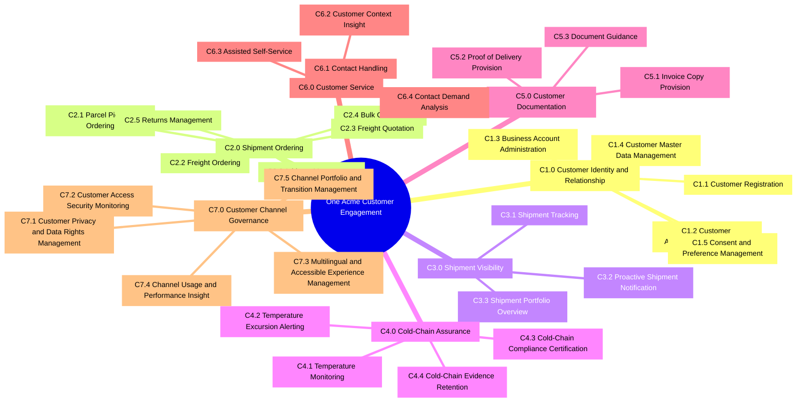
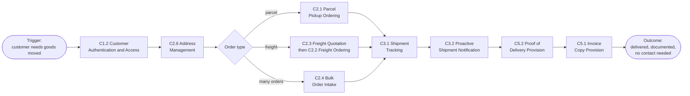
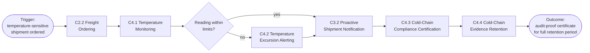
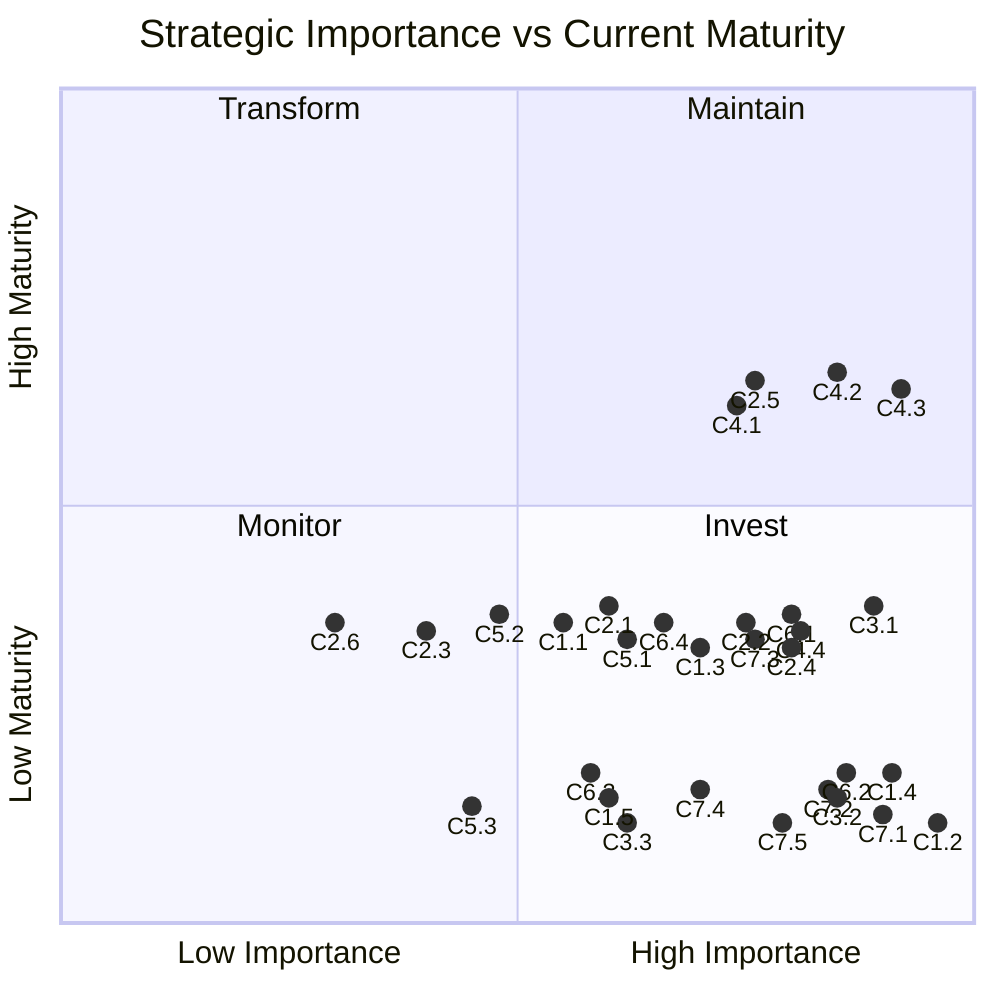

# Business Capability Map: One Acme Customer Engagement

## Document Control

| Field | Value |
|-------|-------|
| **Document ID** | ARC-001-BPCM-v1.0 |
| **Document Type** | Business Capability Map — TOGAF ADM Phase A (Business Architecture) |
| **Project** | One Acme Customer Portal (Project 001) |
| **Classification** | Internal |
| **Status** | DRAFT |
| **Version** | 1.0 |
| **Created Date** | 2026-10-08 |
| **Last Modified** | 2026-10-08 |
| **Review Cycle** | Monthly (during active ADM cycle) |
| **Next Review Date** | 2026-11-08 |
| **Owner** | Enterprise Architecture team, for Annelies Claes (COO, Programme Sponsor) |
| **Reviewed By** | [PENDING] |
| **Approved By** | [PENDING] |
| **Distribution** | Architecture Board; programme steering committee; portal owners; Head of Customer Service; CISO; DPO |

> **Classification note**: This document uses the Acme data classification scheme (Public / Internal / Confidential / Strictly Confidential) [AIP-C1]. It is marked **Internal** because it holds no personal data, budget figures or supplier negotiation positions.

### Revision History

| Version | Date | Author | Changes | Approved By | Approval Date |
|---------|------|--------|---------|-------------|---------------|
| 1.0 | 2026-10-08 | ArcKit AI | Initial creation from `/arckit-togaf-adm:business-capability-map` command | PENDING | PENDING |

---

### Scope and Depth

**Scope**: The customer engagement domain across all three Acme business units: Acme Parcel, Brabant Freight and Flanders Cold Chain. This follows the Business Unit scope of the Architecture Vision (ARC-001-ADMP-v1.0).

The map describes what Acme must be able to do for its customers, independent of today's portals and any future product. Capabilities that belong to other domains are excluded:

- transport execution (transport management systems)
- invoicing and e-invoicing (ERP)
- pricing
- driver apps
- workforce identity

These are out of the ADM scope [PM-C2].

**Depth**: **Level 2** (domains plus sub-capabilities), as requested.

- **IDs**: domains are `C{N}.0` and sub-capabilities `C{N}.{M}`.
- **Level 3**: the `C{N}.{M}.{K}` breakdown is deferred. It can be added in v2.0, starting with the capabilities in the "Invest" quadrant.
- **Quality checklist**: its default expects three levels. That check is waived for this version by the user's choice of depth.

**Maturity evidence**: Current maturity is assessed from the portal inventory, the stakeholder interviews and the programme mandate. Capability owners must validate it (see Next Steps in Section 3).

---

## 1. Capability Hierarchy

### Level 1: Capability Domains

| Domain ID | Domain | Description | ADMP drivers |
|-----------|--------|-------------|--------------|
| C1.0 | Customer Identity and Relationship | Know who the customer is, across all business units, and let them access Acme securely with the right permissions and preferences | DR-S1, DR-C2, DR-T4 |
| C2.0 | Shipment Ordering | Let customers order Acme services (pickups, freight, bulk orders, returns) without contacting staff | DR-S2, DR-O5, DR-T1 |
| C3.0 | Shipment Visibility | Tell customers where their shipments are, before they need to ask | DR-O1, DR-S2 |
| C4.0 | Cold-Chain Assurance | Prove to food and pharma customers that their goods stayed within temperature limits, and alert them when they did not | DR-C5, DR-O5, DR-T3 |
| C5.0 | Customer Documentation | Give customers the documents they need (invoice copies, proof of delivery) and help them understand them | DR-O3 |
| C6.0 | Customer Service | Resolve customer contacts at the first attempt, with the right information and the minimum personal data | DR-O1, DR-O2, DR-C1 |
| C7.0 | Customer Channel Governance | Run the customer channels compliantly, securely, accessibly and cost-effectively, and evolve or retire them | DR-C1, DR-C3, DR-C4, DR-S3, DR-T2 |

### Level 2: Sub-Capabilities

Each domain's sub-capabilities are written to be mutually exclusive and, together, to cover the domain. Every sub-capability appears in exactly one domain.

#### C1.0 Customer Identity and Relationship

| ID | Sub-Capability | Description |
|----|----------------|-------------|
| C1.1 | Customer Registration | Let new consumers and business customers create an Acme relationship and verify who they are |
| C1.2 | Customer Authentication and Access | Let customers prove their identity once, securely (including multi-factor), for all Acme services [SI-C1] |
| C1.3 | Business Account Administration | Let customer organisations manage their own users, roles and delegated access across contracts and business units |
| C1.4 | Customer Master Data Management | Keep one authoritative, de-duplicated customer record across business units [PM-C1] |
| C1.5 | Consent and Preference Management | Hold each customer's consent, language and communication preferences once and respect them everywhere |

#### C2.0 Shipment Ordering

| ID | Sub-Capability | Description |
|----|----------------|-------------|
| C2.1 | Parcel Pickup Ordering | Let customers order parcel collections |
| C2.2 | Freight Ordering | Let customers order pallet and part-load freight transport |
| C2.3 | Freight Quotation | Give customers a freight quote they can accept and turn into an order |
| C2.4 | Bulk Order Intake | Accept many orders at once in agreed structured formats (EDI order upload) [SI-C2] |
| C2.5 | Returns Management | Let consumers and businesses arrange a return and follow it to completion [SI-C2] |
| C2.6 | Address Management | Keep the customer's frequently used sender and receiver addresses ready for ordering |

#### C3.0 Shipment Visibility

| ID | Sub-Capability | Description |
|----|----------------|-------------|
| C3.1 | Shipment Tracking | Show the status, history and expected delivery of any shipment, in any business unit |
| C3.2 | Proactive Shipment Notification | Tell customers about status changes and exceptions without them asking |
| C3.3 | Shipment Portfolio Overview | Give business customers an overview of all their shipments across business units |

#### C4.0 Cold-Chain Assurance

| ID | Sub-Capability | Description |
|----|----------------|-------------|
| C4.1 | Temperature Monitoring | Show the temperature history of a cold-chain shipment as it happens |
| C4.2 | Temperature Excursion Alerting | Alert the customer to readings outside agreed limits and record their response [SI-C2] |
| C4.3 | Cold-Chain Compliance Certification | Issue GDP and HACCP compliance certificates that hold up in an audit [SI-C3] |
| C4.4 | Cold-Chain Evidence Retention | Keep temperature records and certificates complete, unaltered and retrievable for their retention period |

#### C5.0 Customer Documentation

| ID | Sub-Capability | Description |
|----|----------------|-------------|
| C5.1 | Invoice Copy Provision | Give customers copies of their invoices for all contracts in one place [AIP-C2] |
| C5.2 | Proof of Delivery Provision | Give customers proof that their shipments were delivered |
| C5.3 | Document Guidance | Help customers understand Acme documents, such as the different invoice layouts per business unit [SI-C4] |

#### C6.0 Customer Service

| ID | Sub-Capability | Description |
|----|----------------|-------------|
| C6.1 | Contact Handling | Receive and resolve customer contacts across channels, for all business units |
| C6.2 | Customer Context Insight | Give agents the shipment, account and contact context relevant to the current contact, and no more [SI-C5] |
| C6.3 | Assisted Self-Service | Let agents complete self-service tasks on the customer's behalf, with the same result as the digital channel |
| C6.4 | Contact Demand Analysis | Understand why customers contact Acme, so that the causes can be removed |

#### C7.0 Customer Channel Governance

| ID | Sub-Capability | Description |
|----|----------------|-------------|
| C7.1 | Customer Privacy and Data Rights Management | Meet data subject rights, data minimisation and classification obligations for customer data [SI-C6] |
| C7.2 | Customer Access Security Monitoring | Detect and respond to misuse of customer accounts and channels [SI-C7] |
| C7.3 | Multilingual and Accessible Experience Management | Make every customer interaction available in Dutch and French (and English), accessible to WCAG 2.2 AA [AIP-C3] |
| C7.4 | Channel Usage and Performance Insight | Measure how customers use the channels, where they succeed and where they fail |
| C7.5 | Channel Portfolio and Transition Management | Decide which customer channels exist, move customers between them and retire old ones [PM-C3] |

### Level 3: Detailed Capabilities

Not produced in this version (Level 2 depth chosen). The capabilities recommended for Level 3 breakdown first are C1.2, C1.4, C3.2, C4.3, C6.2 and C7.1, which have the largest gaps and highest importance (Section 3).

### Capability Map (Mermaid mindmap)

---

## 2. Value Streams

### Value Stream Matrix

| Value Stream | Capabilities | Trigger | Outcome |
|--------------|--------------|---------|---------|
| VS-001 Order to Delivery | C1.2, C1.3, C2.6, C2.1 / C2.2 / C2.3 / C2.4, C3.1, C3.2, C3.3, C5.2, C5.1 | A business customer needs goods collected and delivered | Goods delivered, proof of delivery and invoice copy available, with no need to contact Acme |
| VS-002 Cold-Chain Assured Delivery | C1.2, C2.2, C4.1, C4.2, C4.3, C4.4, C3.2 | A food or pharma customer ships temperature-sensitive goods | Goods delivered within limits (or excursion handled in time) and an audit-proof certificate available for the full retention period |
| VS-003 Return a Parcel | C1.2 (or guest access), C2.5, C3.1, C3.2, C1.5 | A consumer or business wants to send a delivered parcel back | Return collected or dropped off, tracked and confirmed as received |
| VS-004 Query to Resolution | C6.1, C6.2, C3.1, C5.1, C5.3, C6.3, C6.4 | A customer contacts Acme with a question (for example, "where is my shipment?" or "which invoice is right?") | Question resolved at the first contact, and its cause analysed so that similar contacts can be prevented |
| VS-005 Customer Onboarding and Migration | C7.5, C1.4, C1.1, C1.2, C1.3, C1.5, C7.3 | A new customer joins, or a migration wave moves legacy portal users | The customer has one active Acme account with the right users, roles, language and consents |

Shared capabilities: C1.2 takes part in four value streams and C3.1 in three. Each is shown once in the hierarchy and reused by the value streams.

### Value Stream Flow

**VS-001 Order to Delivery.** This value stream holds the "where is my shipment?" target, which accounts for 31% of contacts [SI-C8].

**VS-002 Cold-Chain Assured Delivery.** This value stream holds the non-negotiable pharma evidence [SI-C3].

---

## 3. Capability Maturity Assessment

**Scale**:

| Level | Name | Meaning |
|-------|------|---------|
| L1 | Initial | Ad hoc, undocumented, inconsistent |
| L2 | Managed | Documented and repeatable, but managed locally |
| L3 | Defined | Standardised and integrated across the organisation |
| L4 | Quantitatively Managed | Measured, controlled, predictable |
| L5 | Optimising | Continuously improved, best in class |

Many capabilities exist separately in each business unit today. A capability that works within one business unit but not across the group is rated no higher than L2.

| Capability | Current (L1-L5) | Target (L1-L5) | Gap | Priority | Evidence for current level |
|------------|----------------|---------------|-----|----------|----------------------------|
| C1.1 Customer Registration | L2 | L3 | +1 | Medium | Three separate registration routes and user stores [PI-C1] |
| C1.2 Customer Authentication and Access | L1 | L4 | +3 | High | Portal A has no MFA, Portal B's MFA is optional, Portal C enforces MFA for admins only [PI-C1]; credential stuffing in Feb 2025 [SI-C7] |
| C1.3 Business Account Administration | L2 | L3 | +1 | High | User management exists per portal; no delegation across business units |
| C1.4 Customer Master Data Management | L1 | L4 | +3 | High | No single customer record; 1,800 customers in more than one portal [ACP-C1]; data in three portals and two CRMs [SI-C6] |
| C1.5 Consent and Preference Management | L1 | L3 | +2 | Medium | Preferences held per portal; languages inconsistent [PI-C2] |
| C2.1 Parcel Pickup Ordering | L2 | L3 | +1 | Medium | Working within Acme Parcel only [PI-C3] |
| C2.2 Freight Ordering | L2 | L3 | +1 | High | Working, but 6.8 s average page load and no new features since 2022 [PI-C4]; platform end of life June 2027 |
| C2.3 Freight Quotation | L2 | L3 | +1 | Low | Exists in Portal B only; priority depends on usage data [SI-C9] |
| C2.4 Bulk Order Intake | L2 | L3 | +1 | High | EDI order upload in Portal B; a must-keep feature for customers [SI-C2] |
| C2.5 Returns Management | L3 | L3 | 0 | High | Established consumer and business returns flow in Portal A [PI-C3]; must be kept through migration [SI-C2] |
| C2.6 Address Management | L2 | L3 | +1 | Low | Address book in Portal A only [PI-C3] |
| C3.1 Shipment Tracking | L2 | L4 | +2 | High | Tracking per business unit only; "where is my shipment?" is 31% of 410,000 contacts [SI-C8] |
| C3.2 Proactive Shipment Notification | L1 | L4 | +2 | High | No proactive shipment notifications in the portal inventory, so customers call instead [SI-C8] |
| C3.3 Shipment Portfolio Overview | L1 | L3 | +2 | Medium | No view across business units for multi-service customers [ACP-C1] |
| C4.1 Temperature Monitoring | L3 | L4 | +1 | High | Established in Portal C (temperature monitoring from telematics) [PI-C3] |
| C4.2 Temperature Excursion Alerting | L3 | L4 | +1 | High | Alerts exist in Portal C and are relied on by customers [SI-C2] |
| C4.3 Cold-Chain Compliance Certification | L3 | L4 | +1 | High | HACCP and GDP certificates issued today [PI-C3]; audit-proofness must be measurable [SI-C3] |
| C4.4 Cold-Chain Evidence Retention | L2 | L4 | +2 | High | Records held by a SaaS supplier with support access from outside the EU (open finding) [SI-C10] |
| C5.1 Invoice Copy Provision | L2 | L3 | +1 | Medium | Invoice copies per portal; three layouts confuse customers [SI-C4] |
| C5.2 Proof of Delivery Provision | L2 | L3 | +1 | Medium | Available in Portal B [PI-C3] |
| C5.3 Document Guidance | L1 | L3 | +2 | Low | No guidance; customers call to ask which invoice is right [SI-C4] |
| C6.1 Contact Handling | L2 | L4 | +2 | High | Average handling time 7 min 40 s; first-contact resolution 64% [SI-C11] |
| C6.2 Customer Context Insight | L1 | L3 | +2 | High | Agents switch between three portals and two CRMs [SI-C11]; no data minimisation by design [SI-C5] |
| C6.3 Assisted Self-Service | L1 | L3 | +2 | Medium | Agents use separate tools, not the customer's services |
| C6.4 Contact Demand Analysis | L2 | L4 | +2 | Medium | Contact reasons are recorded ("where is my shipment?" at 31%), but coding differs across the two CRMs |
| C7.1 Customer Privacy and Data Rights Management | L1 | L4 | +3 | High | Data subject requests answered in 41 days on average against a one-month limit [SI-C6] |
| C7.2 Customer Access Security Monitoring | L1 | L4 | +3 | High | No central security logging for the portals; the CISO's requirement [SI-C7] |
| C7.3 Multilingual and Accessible Experience Management | L2 | L3 | +1 | High | Portal A has NL/FR/EN; Portal B's French is incomplete; Portal C has no French [PI-C2] |
| C7.4 Channel Usage and Performance Insight | L1 | L4 | +3 | High | Portal owners lack usage data to decide which features to keep [SI-C9] |
| C7.5 Channel Portfolio and Transition Management | L1 | L3 | +2 | High | Three portals grew by acquisition with no group channel management [PM-C3]; peak freeze discipline exists [AIP-C4] |

**Maturity distribution (current)**:

| Level | Capabilities |
|-------|--------------|
| L1 | 12 |
| L2 | 14 |
| L3 | 4 (C2.5, C4.1, C4.2, C4.3) |
| L4 | 0 |
| L5 | 0 |

Targets are mostly L3, rising to L4 where the mandate sets measured targets: identity, tracking, cold chain, customer service and privacy [PM-C4].

**Validation needed**: these ratings are based on documents. Each capability owner should confirm their rating, including portal owners for C2 and C4, the Head of Customer Service for C6, and the CISO and DPO for C7.1 and C7.2.

---

## 4. Capability Heatmap

The quadrants are laid out to match Mermaid's numbering:

| Mermaid quadrant | Position | Meaning | Label |
|------------------|----------|---------|-------|
| quadrant-1 | Top right | High importance, high maturity | Maintain |
| quadrant-2 | Top left | Low importance, high maturity | Transform |
| quadrant-3 | Bottom left | Low importance, low maturity | Monitor |
| quadrant-4 | Bottom right | High importance, low maturity | Invest |

Maturity is plotted as L1 ≈ 0.15, L2 ≈ 0.35, L3 ≈ 0.65, with small offsets so that points do not overlap.

**Reading the heatmap**:

- **Invest (22 capabilities)**: C1.1–C1.5, C2.1, C2.2, C2.4, C3.1–C3.3, C4.4, C5.1, C6.1–C6.4 and C7.1–C7.5. The largest gaps on the most important capabilities are:
  - C1.2 Customer Authentication and Access
  - C1.4 Customer Master Data Management
  - C7.1 Customer Privacy and Data Rights Management
  - C7.2 Customer Access Security Monitoring
  - C3.2 Proactive Shipment Notification
  - C6.2 Customer Context Insight
- **Maintain (4 capabilities)**: C2.5 Returns Management, C4.1 Temperature Monitoring, C4.2 Temperature Excursion Alerting and C4.3 Cold-Chain Compliance Certification. These are the strengths customers rely on, and they match the must-keep features named by the portal owners [SI-C2]. **The risk here is losing them during migration, not building them from scratch.** Wave go/no-go criteria should test them first (REQ BR-008).
- **Monitor (4 capabilities)**: C2.3 Freight Quotation, C2.6 Address Management, C5.2 Proof of Delivery Provision and C5.3 Document Guidance. Keep them, with priority set by usage data [SI-C9].
- **Transform (0 capabilities)**: no mature, low-importance capabilities to offload.

---

## 5. Capability-Requirement Traceability

Coverage shows whether a capability in this map addresses the requirement in ARC-001-REQ-v1.0:

- **Full**: a business capability fully addresses the requirement.
- **Partial**: a capability contributes, but the requirement is mainly a technology quality or an integration, to be designed in Phase C or D.
- **Gap**: no customer-engagement capability addresses the requirement.

### Business Requirements

| Requirement | Capability | Coverage |
|-------------|------------|----------|
| BR-001 One customer portal replaces A, B, C | C7.5 (with all domains) | Full |
| BR-002 Wave-based migration with go/no-go | C7.5 | Full |
| BR-003 No migrations during peak freeze | C7.5 | Partial — change control is a group IT governance capability |
| BR-004 Portal run cost at least 35% lower | — | Gap — IT cost management is outside the customer engagement domain |
| BR-005 Payback within 4 years | — | Gap — benefits and investment management are outside this domain |
| BR-006 40% fewer "where is my shipment?" contacts | C3.1, C3.2, C6.4 | Full |
| BR-007 Handling time and first-contact resolution | C6.1, C6.2, C6.3 | Full |
| BR-008 Keep critical features | C2.5, C2.4, C4.2, C4.3 | Full |
| BR-009 One account per customer | C1.4, C1.3 | Full |
| BR-010 Compliance by design | C7.1, C7.2, C7.3 | Partial — NIS2 technical controls are delivered in Phase D |
| BR-011 Key decisions on time | — | Gap — programme governance, not a customer capability |
| BR-012 Digital self-service by default | C7.4, with C2, C3 and C5 | Full |

### Functional Requirements

| Requirement | Capability | Coverage |
|-------------|------------|----------|
| FR-001 Single customer login | C1.2 | Full |
| FR-002 Multi-factor authentication | C1.2 | Full |
| FR-003 Self-registration and recovery | C1.1 | Full |
| FR-004 Business accounts and user management | C1.3 | Full |
| FR-005 Account migration and activation | C7.5, C1.4 | Full |
| FR-006 Language selection | C1.5, C7.3 | Full |
| FR-007 Track and trace across business units | C3.1 | Full |
| FR-008 Proactive shipment notifications | C3.2 | Full |
| FR-009 Business shipment dashboard | C3.3 | Full |
| FR-010 Parcel pickup booking | C2.1 | Full |
| FR-011 Pallet and part-load freight booking | C2.2 | Full |
| FR-012 Freight quotes | C2.3 | Full |
| FR-013 Address book | C2.6 | Full |
| FR-014 EDI order upload | C2.4 | Full |
| FR-015 Returns flow | C2.5 | Full |
| FR-016 Invoice copies | C5.1, C5.3 | Full |
| FR-017 Proof of delivery | C5.2 | Full |
| FR-018 Temperature monitoring view | C4.1 | Full |
| FR-019 Temperature alerts | C4.2 | Full |
| FR-020 Compliance certificates | C4.3 | Full |
| FR-021 Historic temperature record migration | C4.4 | Full |
| FR-022 Agent view across business units | C6.2 | Full |
| FR-023 Contact-scoped data in the agent view | C6.2, C7.1 | Full |
| FR-024 Assisted actions | C6.3 | Full |
| FR-025 CRM contact history | C6.2 | Partial — depends on CRMs that are out of scope |
| FR-026 Data subject request support | C7.1 | Full |
| FR-027 Consent and preferences | C1.5 | Full |
| FR-028 Multilingual content management | C7.3 | Full |
| FR-029 Usage analytics | C7.4 | Full |
| FR-030 Legacy redirects and transition | C7.5 | Full |

### Non-Functional Requirements

| Requirement | Capability | Coverage |
|-------------|------------|----------|
| NFR-P-001 Response time | C3.1, C6.2 | Partial |
| NFR-P-002 Throughput | C2.4, C4.1 | Partial |
| NFR-A-001 Availability | C3.1, C4.2 | Partial |
| NFR-A-002 Disaster recovery | C4.4 | Partial |
| NFR-A-003 Fault tolerance | C2.1, C2.2, C4.2 | Partial |
| NFR-S-001 Horizontal scaling | C3.1 | Partial |
| NFR-S-002 Data volume scaling | C4.4 | Partial |
| NFR-SEC-001 Authentication | C1.2 | Full |
| NFR-SEC-002 Authorisation | C1.3, C6.2 | Full |
| NFR-SEC-003 Encryption | — | Gap — technology control (Phase D) |
| NFR-SEC-004 Secrets management | — | Gap — technology control (Phase D) |
| NFR-SEC-005 Vulnerability management | — | Gap — group security operations capability |
| NFR-SEC-006 Central security logging | C7.2 | Full |
| NFR-SEC-007 Interim Portal A protection | C1.2, C7.2 | Partial |
| NFR-C-001 Data privacy compliance | C7.1 | Full |
| NFR-C-002 Audit logging | C7.1, C7.2 | Full |
| NFR-C-003 NIS2 evidence | C7.2 | Partial |
| NFR-C-004 EU/EEA residency including support | C7.1 | Partial — supplier management is outside this domain |
| NFR-C-005 Cold-chain evidence integrity | C4.3, C4.4 | Full |
| NFR-U-001 User experience | C7.3 | Full |
| NFR-U-002 Accessibility | C7.3 | Full |
| NFR-U-003 Localisation | C7.3 | Full |
| NFR-M-001 Observability | C7.4 | Partial |
| NFR-M-002 Documentation | — | Gap — IT delivery practice |
| NFR-M-003 Operational runbooks | — | Gap — IT operations practice |
| NFR-M-004 Configuration over customisation | — | Gap — sourcing and engineering practice |
| NFR-I-001 API standards | — | Gap — technology standard (Phase C/D) |
| NFR-I-002 Integration capabilities | — | Gap — technology standard (Phase C/D) |
| NFR-I-003 Data portability and exit | C7.5 | Partial |

### Integration and Data Requirements

| Requirement | Capability | Coverage |
|-------------|------------|----------|
| INT-001 Parcel transport management system | C2.1, C2.5, C3.1, C5.2 | Partial |
| INT-002 Freight transport management system | C2.2, C2.3, C2.4, C3.1, C5.2 | Partial |
| INT-003 ERP invoice copies | C5.1 | Partial |
| INT-004 Cold-chain telematics feed | C4.1, C4.2 | Partial |
| INT-005 Acme Parcel CRM | C6.2 | Partial |
| INT-006 Brabant Freight CRM | C6.2 | Partial |
| INT-007 Workforce identity | C6.1 | Partial |
| INT-008 Central security monitoring | C7.2 | Partial |
| INT-009 Notification delivery | C3.2, C4.2 | Partial |
| INT-010 Migration extracts | C7.5 | Partial |
| DR-001 One authoritative customer record | C1.4 | Full |
| DR-002 Classification with the Acme scheme | C7.1 | Partial |
| DR-003 Retention and deletion | C7.1 | Full |
| DR-004 Matching and merging | C1.4 | Full |
| DR-005 Migration reconciliation | C7.5 | Full |
| DR-006 Temperature record integrity and retention | C4.4 | Full |
| DR-007 EU/EEA residency of data | C7.1 | Partial |
| DR-008 No live personal data in non-production | — | Gap — IT delivery practice |

### Coverage Summary

| Coverage | BR | FR | NFR | INT | DR | Total |
|----------|----|----|-----|-----|----|-------|
| Full | 7 | 29 | 9 | 0 | 5 | **50** |
| Partial | 2 | 1 | 12 | 10 | 2 | **27** |
| Gap | 3 | 0 | 8 | 0 | 1 | **12** |

**Interpretation**:

- **The 9 technology and delivery gaps are expected.** These are NFR-SEC-003, NFR-SEC-004, NFR-SEC-005, NFR-M-002, NFR-M-003, NFR-M-004, NFR-I-001, NFR-I-002 and DR-008. They are engineering practices, not business capabilities, and will be covered in Phases C and D.
- **The 3 business requirement gaps need an owner.** BR-004 (run cost), BR-005 (payback) and BR-011 (decisions) depend on group capabilities outside this domain: IT financial management, benefits management and programme governance. The steering committee should confirm who owns these, which the RACI in ARC-001-STKE-v1.0 suggests is the CFO and the Architecture Board.

---

## 6. Capability-Principle Alignment

Alignment describes the **current state** of each capability against the Acme principles in ARC-000-PRIN-v1.0:

- **Aligned**: today's way of working follows the principle.
- **Partial**: it partly follows the principle.
- **Misaligned**: it conflicts with the principle and needs remediation.

The target-state design in ARC-001-REQ-v1.0 aligns with all principles.

### By Principle

| Principle | Related Capabilities | Alignment |
|-----------|---------------------|-----------|
| 1 One Acme Customer Experience | C1.4, C3.1, C3.3, C6.2 | Misaligned — three portals, no shared record or view [ACP-C1] |
| 2 Reuse, Then Buy, Then Build | C2.1, C2.2, C7.5 | Partial — Portals A and B are custom builds; Portal C is SaaS [PI-C5] |
| 3 Digital Self-Service by Default | C3.2, C5.3, C6.3 | Partial — no proactive notification or document guidance |
| 4 Compliance by Design | C4.3, C7.1 | Partial — cold-chain certification aligned; data rights misaligned |
| 5 Cost-Conscious Architecture | C7.5 | Partial — three run costs for overlapping services [PI-C6] |
| 6 Scalability and Peak-Season Elasticity | C3.1, C2.2 | Partial — Portal B is slow even outside peak [PI-C4] |
| 7 Resilience and Fault Tolerance | C3.1, C4.2 | Partial — no evidence available; assess in Phase D |
| 8 Security by Design | C1.2, C7.2 | Misaligned — no MFA on Portal A; no central security logging [SI-C7] |
| 9 Unified Identity and Access | C1.2, C1.3 | Misaligned — three user stores [PI-C1] |
| 10 Observability | C7.4 | Misaligned — no usage data [SI-C9] |
| 11 EU-Hosted, Cloud-First Platform | C4.4 | Misaligned — support access from outside the EU [SI-C10] |
| 12 Data Classification and Sovereignty | C7.1, C4.4 | Partial |
| 13 Privacy by Design | C6.2, C7.1, C1.5 | Misaligned — data subject request deadline missed; agents see all data |
| 14 Single Source of Truth | C1.4, C5.1 | Partial — the ERP is already the invoice source [AIP-C2]; customer data is not single-sourced |
| 15 Data Quality and Lineage | C1.4 | Misaligned — duplicates across portals |
| 16 Standard Interfaces | C2.4 | Aligned — structured EDI order intake |
| 17 Loose Coupling and Asynchronous Integration | C3.2, C4.2 | Partial |
| 18 Accessible and Multilingual by Design | C7.3 | Partial — Portal C has no French [PI-C2] |
| 19 Performance and Efficiency | C2.2 | Partial — 6.8 s page load [PI-C4] |
| 20 Availability and Reliability | C4.2 | Partial — assess in Phase D |
| 21 Maintainability | C2.1, C2.2 | Partial — out-of-support platforms behind both |
| 22 Infrastructure as Code | — | Not assessable at capability level |
| 23 Automated Testing | — | Not assessable at capability level |
| 24 CI/CD and Change Windows | C7.5 | Aligned — peak freeze in force [AIP-C4] |

### By Capability (overall current alignment)

| Alignment | Count | Capabilities |
|-----------|-------|--------------|
| Aligned | 9 | C2.1, C2.3, C2.4, C2.5, C2.6, C4.1, C4.2, C4.3, C5.2 |
| Partial | 12 | C1.1, C1.3, C1.5, C2.2, C3.1, C5.1, C5.3, C6.1, C6.3, C6.4, C7.3, C7.5 |
| Misaligned | 9 | C1.2, C1.4, C3.2, C3.3, C4.4, C6.2, C7.1, C7.2, C7.4 |

All 9 misaligned capabilities are in the Invest quadrant and are covered by MUST_HAVE requirements, so remediation is already planned.

The capabilities rated Aligned are judged on how the business capability works. The platforms behind C2.1 and C2.5 (Portal A) are out of support; that is a technology issue under principle 21, handled in Phase D.

---

## 7. Traceability

| Source | Artifact | Link |
|--------|----------|------|
| ADM Preliminary | `ARC-001-ADMP-v1.0.md` | Scope (Business Unit, customer engagement domain), drivers DR-S1 to DR-T5 mapped to domains in Section 1; success criteria 1–13 supported through the requirements in Section 5 |
| Requirements | `ARC-001-REQ-v1.0.md` | All 89 requirements mapped in Section 5 (50 Full, 27 Partial, 12 Gap) |
| Stakeholders | `ARC-001-STKE-v1.0.md` | Goals G-1 to G-10 map through the requirements; must-keep features (SD-11, SD-12) map to the Maintain quadrant; the agent-view conflict (SD-7 vs SD-10) is reflected in the definition of C6.2 |
| Principles | `ARC-000-PRIN-v1.0.md` | All 24 principles assessed in Section 6 |
| Applications | `ARC-001-APP` (not created) | Not available; run `/arckit-togaf-adm:application-inventory`. The current portal-to-capability support is summarised below from the portal inventory |

### Current Application Support (from the portal inventory)

| Capability | Portal A | Portal B | Portal C | Other systems |
|------------|----------|----------|----------|---------------|
| C1.2 Customer Authentication and Access | Own user store, no MFA | Own user store, optional MFA | Vendor login, MFA for admins | — |
| C2.1 / C2.5 / C2.6 Parcel ordering, returns, addresses | Supports | — | — | Parcel transport management system |
| C2.2 / C2.3 / C2.4 Freight ordering, quotes, bulk intake | — | Supports | — | Freight transport management system |
| C3.1 Shipment Tracking | Supports (parcel) | Supports (freight) | Supports (cold chain) | Transport management systems, telematics |
| C4.1–C4.4 Cold-chain assurance | — | — | Supports | Telematics feed |
| C5.1 Invoice Copy Provision | Supports | Supports | — | ERP (source) |
| C5.2 Proof of Delivery Provision | — | Supports | — | Freight transport management system |
| C6.2 Customer Context Insight | Used by agents | Used by agents | Used by agents | Two CRMs |

Source: portal inventory [PI-C3] [PI-C5].

---

## 8. External References

> This section links content in this document back to its source documents, following the ArcKit citation instructions.

### Document Register

| Doc ID | Filename | Type | Source Location | Description |
|--------|----------|------|-----------------|-------------|
| PM | programme-mandate.md | Programme Mandate | 001-customer-portal-consolidation/external/ | Executive Committee mandate of 15 September 2026 |
| SI | stakeholder-interviews.md | Interview Notes | 001-customer-portal-consolidation/external/ | EA team interview notes, September 2026 |
| PI | portal-inventory.md | Inventory | 001-customer-portal-consolidation/external/ | Current inventory of Portals A, B and C, August 2026 |
| ACP | acme-company-profile.md | Company Profile | 000-global/policies/ | Business units, customer overlap, Strategy 2030 |
| AIP | acme-it-policies.md | Policy | 000-global/policies/ | IT and architecture policies |

### Citations

| Citation ID | Doc ID | Page/Section | Category | Quoted Passage |
|-------------|--------|--------------|----------|----------------|
| PM-C1 | PM | Objective | Business Requirement | "Replace portals A, B and C with one customer portal and one customer record, fully in Dutch and French (English optional), by 31 December 2028." |
| PM-C2 | PM | Scope | Business Requirement | "Out: replacing the TMS systems, SAP S/4HANA or the CRMs; pricing changes; driver apps." |
| PM-C3 | PM | Scope | Functional Requirement | "In: customer login, tracking, parcel and freight booking, returns, invoice and proof-of-delivery documents, temperature views for cold chain customers, customer user management, the customer service agent view, migration and switch-off of A, B and C." |
| PM-C4 | PM | Targets | Business Requirement | Target list: portal run cost down at least 35%; "where is my shipment?" calls down 40%; average handling time down 25%; first-contact resolution at least 80%; 100% of data subject requests within one month; MFA for all users, mandatory for business administrators |
| SI-C1 | SI | Sofie Peeters - CIO | Design Decision | "Wants one customer identity platform for all channels." |
| SI-C2 | SI | Portal owners | Stakeholder Need | "Fear losing features their customers rely on: A the returns flow, B the EDI order upload, C the temperature alerts and certificates." |
| SI-C3 | SI | Portal owners | Compliance Constraint | "Pharma customers require audit-proof temperature records: non-negotiable for Tom." |
| SI-C4 | SI | Nathalie Lambert - Head of Customer Service | Stakeholder Need | "Customers with several contracts get three invoice layouts and call to ask which one is right." |
| SI-C5 | SI | Isabelle Martin - DPO | Data Requirement | "Agents must not see more personal data than the contact needs." |
| SI-C6 | SI | Isabelle Martin - DPO | Compliance Constraint | "140 data subject requests per year, answered in 41 days on average (legal limit: one month). The data sits in three portals and two CRMs." |
| SI-C7 | SI | Pieter Janssens - CISO | Security Requirement | "Portal A has no MFA and was hit by credential stuffing in February 2025." / "Wants one hardened login and central security logging." |
| SI-C8 | SI | Nathalie Lambert - Head of Customer Service | Stakeholder Need | "410,000 contacts per year; 31% are \"where is my shipment?\"." |
| SI-C9 | SI | Portal owners | Stakeholder Need | "All three want usage data before deciding what can be dropped." |
| SI-C10 | SI | Isabelle Martin - DPO | Risk Factor | "TrackBox support access from outside the EU is an open finding." |
| SI-C11 | SI | Nathalie Lambert - Head of Customer Service | Stakeholder Need | "Agents switch between three portals and two CRMs. Average handling time 7 min 40 s; first-contact resolution 64%." |
| PI-C1 | PI | Login row | Security Requirement | Table row: own user database, no MFA (A); own user database, MFA optional (B); vendor login, MFA for admins only (C) |
| PI-C2 | PI | Languages row | Compliance Constraint | Table row: NL, FR, EN (A); NL, FR (French incomplete) (B); NL, EN (no French) (C) |
| PI-C3 | PI | Key features row | Functional Requirement | Table row: track and trace, pickup booking, returns, invoice PDFs, address book (A); pallet booking, quotes, proof of delivery, invoices, EDI order upload (B); temperature monitoring, alerts, compliance certificates (HACCP, GDP) (C) |
| PI-C4 | PI | Known issues row | Risk Factor | Table row (B): slow (6.8 s average page load), no new features since 2022 |
| PI-C5 | PI | Technology and Live since rows | Design Decision | Table rows: .NET Framework 4.6, built in-house 2014 (A); Liferay 6.2, built by an agency 2016 (B); SaaS product "TrackBox", subscription 2019 (C) |
| PI-C6 | PI | Annual run cost row | Business Requirement | Table row: EUR 610,000 (A); EUR 420,000 (B); EUR 280,000 (C). "Total run cost: EUR 1.31M per year." |
| ACP-C1 | ACP | At a glance | Stakeholder Need | "1,800 business customers use more than one portal (overlap analysis, Q2 2026)." |
| AIP-C1 | AIP | Data classification | Data Requirement | "Public, Internal, Confidential, Strictly Confidential." |
| AIP-C2 | AIP | Security and compliance | Integration Requirement | "Belgian B2B e-invoicing via Peppol is live since 1 January 2026 from SAP S/4HANA. Portals show invoice copies only." |
| AIP-C3 | AIP | Security and compliance | Compliance Constraint | "New customer-facing services meet WCAG 2.2 AA." |
| AIP-C4 | AIP | Governance | Business Requirement | "Peak freeze: no go-lives or migrations between 15 October and 10 January." |

### Unreferenced Documents

| Filename | Source Location | Reason |
|----------|-----------------|--------|
| — | — | All consulted documents were cited |

---

**Generated by**: ArcKit `/arckit-togaf-adm:business-capability-map` command
**Generated on**: 2026-10-08 GMT
**ArcKit Version**: 6.17.5
**Project**: One Acme Customer Portal (Project 001)
**AI Model**: Claude Opus 5.5 (claude-opus-5-5)

<!-- arckit-provenance:start -->

## Build Provenance

*Stamped automatically by the ArcKit plugin's `provenance-stamp.mjs` PostToolUse hook. Complements (does not replace) the human-authored footer above. Carries only fields the model can't authoritatively self-report: build context from `.arckit/state.json` and effort levels derived from command frontmatter + the silent-downgrade matrix.*

| Field | Value |
|-------|-------|
| Requested Effort | `high` |
| Effective Effort | _unknown — model not parsed from existing footer_ |
| Stamped at | 2026-10-08T06:36:43.937Z |

<!-- arckit-provenance:end -->
